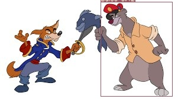

# YoloV3
________
YoloV3 Simplified for training on Colab with custom dataset. 

Added a small dataset of 100 images having 25 images of each class as mentioned below
Baloo
Rebecca
SherKhan
KingLouie

Full credit goes to [this](https://github.com/ultralytics/yolov3), and if you are looking for much more detailed explainiation and features, please refer to the original [source](https://github.com/ultralytics/yolov3). 

Above mentioned custom data set is annotated as per below:
1. Clone this repo: https://github.com/miki998/YoloV3_Annotation_Tool
2. Followed the installation steps as mentioned in the repo. 
3. For the assignment, I have download 100 images of above 4 classes. 
4. Annotated the images using the Annotation tool. Followed the below structure for annotated dataset. 
```
data
  --customdata
    --images/
      --img001.jpg
      --img002.jpg
      --...
    --labels/
      --img001.txt
      --img002.txt
      --...
    custom.data #data file
    custom.names #your class names
    custom.txt #list of name of the images I am training on network. Currently we are using same file for test/train
```
5. custom.data file for above 4 clases are as below
```
  classes=4
  train=data/customdata/custom.txt
  test=data/customdata/custom.txt 
  names=data/customdata/custom.names
```
6. Added custom.names file as mentioned above. Our custom.names file look like this:
```
Baloo
Rebecca
SherKhan
KingLouie

```
7. Baloo above will have a class index of 0. 


**Results**
After training for 300 Epochs, results look awesome!



